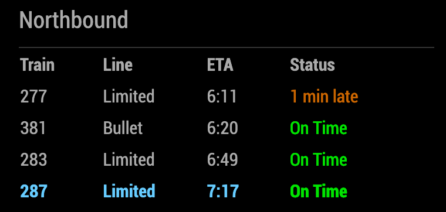
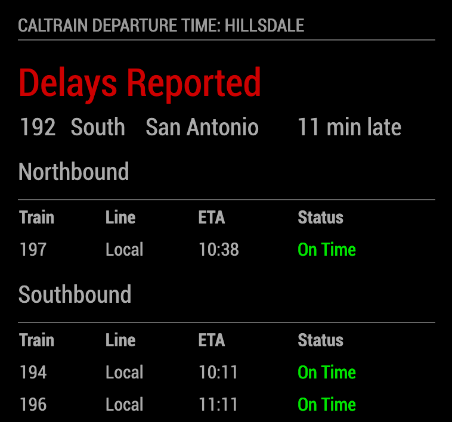

# MMM-Caltrain

This is a module for <strong>MagicMirror</strong><br>
https://magicmirror.builders/<br>
https://github.com/MichMich/MagicMirror


A transportation module that displays the status of upcoming trains for a user defined station, as well as alerting the user when there have been delays reported across the fleet.

This module uses the public API provided by [511.org](https://511.org/).

### Installation
1. Navigate to your magic mirror modules directory and clone this repo:
`git clone https://github.com/efritz09/MMM-Caltrain.git`
2. Navigate into the `MMM-Caltrain` directory, run `npm install request zlib`


### Configuration

At a minimum, you need to supply the following required configuration parameters:
* `key`
* `stationName`

You can request an API key here: https://511.org/open-data/token.

The `stationName` value must be one of those listed in [caltrain-stations.txt](caltrain-stations.txt)

### All Options

| Option                   | Type      | Default | Description                                                                                                                                                                                                                                                                                                   |
|--------------------------|-----------|---------|---------------------------------------------------------------------------------------------------------------------------------------------------------------------------------------------------------------------------------------------------------------------------------------------------------------|
| `key` (required)         | string    | null    | API key for 511.org                                                                                                                                                                                                                                                                                           |      
| `stationName` (required) | string    | null    | Name of the station to watch. Must be one of those listed in [caltrain-stations.txt](caltrain-stations.txt)                                                                                                                                                                                                   |
| `delayThreshold`         | integer   | 600000  | Time in milliseconds that a train must be behind schedule by for it to be reported as "delayed". Default value is 10 minutes.                                                                                                                                                                                 |
| `direction`              | string    | ""      | Selects which trains to display for the given `stationName`. Acceptable values are `north` or `south`. Any other value will resolve to both north and south. Default value is both.                                                                                                                           |
| `requestDelays`          | bool      | true    | If true, requests delayed trains info.                                                                                                                                                                                                                                                                        |
| `showDelayedTrains`      | bool      | true    | If true, shows which trains have been reported as delayed.                                                                                                                                                                                                                                                    |
| `showDelayedWarning`     | bool      | true    | If true, shows the warning message when delayed trains are detected.                                                                                                                                                                                                                                          |
| `timeFormat`             | integer   | 24      | The form of time notation that will be used. Possible values are `12` or `24`.                                                                                                                                                                                                                                |
| `trains`                 | int array | []      | Array of trains to highlight. Useful for displaying trains frequently taken by the user                                                                                                                                                                                                                       |
| `updateInterval`         | integer   | 180000  | Time in milliseconds between status updates. Default is 3 minutes. This number was chosen because the API limits 60 requests per hour, and each interval the module makes 3 requests. Be careful lowering this value unless you modify the other options to reduce the number of requests sent each interval. |

Example configuration file: 
```
{
	module: "MMM-Caltrain",
	position: "top_left",
	config: {
		stationName: "Hillsdale",
		key: "your-personal-key-here",
		direction: "north",
	}
}
```

### Screenshots

#### Normal operating conditions


#### Normal operation with trains defined 


#### Delayed trains detected (with all delay options set to true)


#### Bad stationName string

